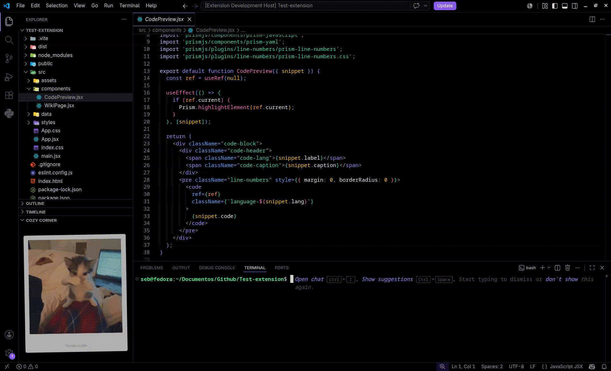
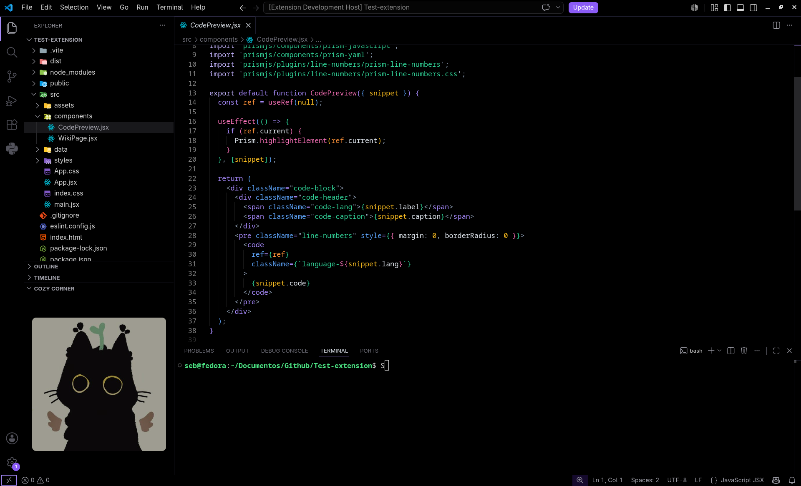

# Cozy Corner

Display an image or GIF in a cozy corner of your Visual Studio Code editor. A minimal and cute companion for your coding sessions.

## Features

- Display images and GIFs directly in the Explorer panel
- Adjustable size, opacity, and brightness
- Optional polaroid-style frame with customizable color and opacity
- Add text to the polaroid frame (max 40 characters)
- Comfortable night mode with brightness and opacity controls
- Lightweight and zero distractions

## Preview

##### Gif preview
<p align="center">
  
</p>

##### Image preview
<p align="center">
  
</p>

## Installation

### From Marketplace 
1. Open Visual Studio Code.
2. Go to Extensions.
3. Search for `Cozy Corner`.
4. Install and enjoy.

### From VSIX
1. Download the `cozy-corner-0.1.0.vsix` file.
2. Open Visual Studio Code.
3. Go to Extensions (`Ctrl+Shift+X`).
4. Click the `...` menu and select `Install from VSIX...`.
5. Select the `.vsix` file.

## Usage

1. Press `Ctrl+Shift+P` to open the command palette.
2. Run **Cozy Corner: Select image** and choose your image or GIF.
3. The image appears in the Explorer panel under the **Cozy Corner** section.
4. Adjust settings in `settings.json`:

```json
{
  "cozycorner.imagePath": "/path/to/your/image.gif",
  "cozycorner.size": 220,
  "cozycorner.opacity": 1.0,
  "cozycorner.brightness": 100,
  "cozycorner.framePolaroid": false,
  "cozycorner.frameColor": "#ffffff",
  "cozycorner.frameOpacity": 1.0,
  "cozycorner.frameText": ""
}
```

## Settings reference

| Setting | Default | Description |
|---|---|---|
| `cozycorner.imagePath` | `""` | Absolute path to the image or GIF |
| `cozycorner.size` | `220` | Width of the image in pixels |
| `cozycorner.opacity` | `1.0` | Opacity of the image (0.0–1.0) |
| `cozycorner.brightness` | `100` | Brightness percentage (0–100) |
| `cozycorner.framePolaroid` | `false` | Enable polaroid-style frame |
| `cozycorner.frameColor` | `"#ffffff"` | Background color of the frame |
| `cozycorner.frameOpacity` | `1.0` | Opacity of the frame background |
| `cozycorner.frameText` | `""` | Text on the frame (max 40 chars) |

## Repository

Source code is available on GitHub:
https://github.com/Sebithaz-dev/Cozy-Corner
